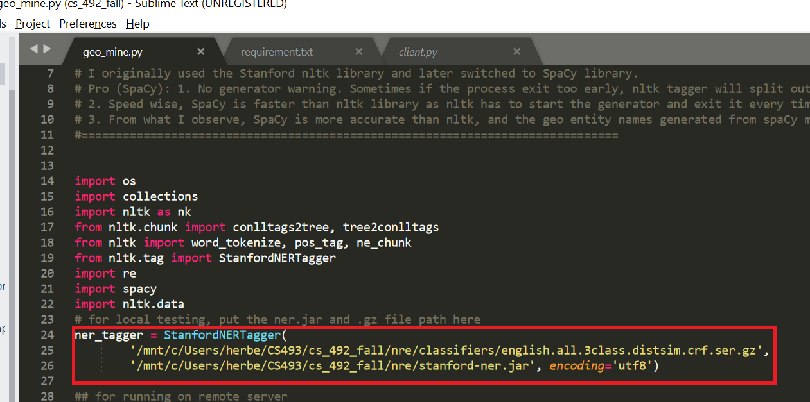

# CS 493: Senior Project 

# To Run:
1. To run the backend:
```bash
cd Client/
```
```python
python client.py
```
# To Install:
```python
pip install -r requirement.txt
```    
Then go to [Stanford NLTK library to download English version:](https://nlp.stanford.edu/software/CRF-NER.shtml)

Once downloaded, please add path of /nre/classifiers/english.all.3class.distsim.crf.ser.gz \
/nre/stanford-ner.jar \
in geo_mine.py file.


    

# To Test:
```python
python geo_mine.py
```    